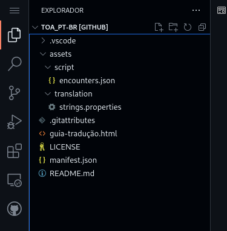
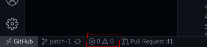
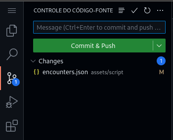
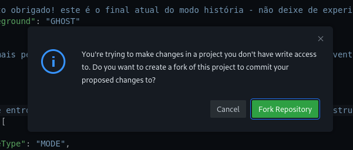
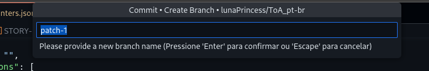
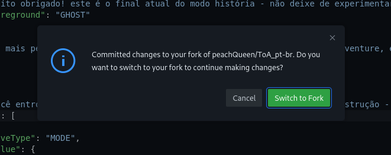
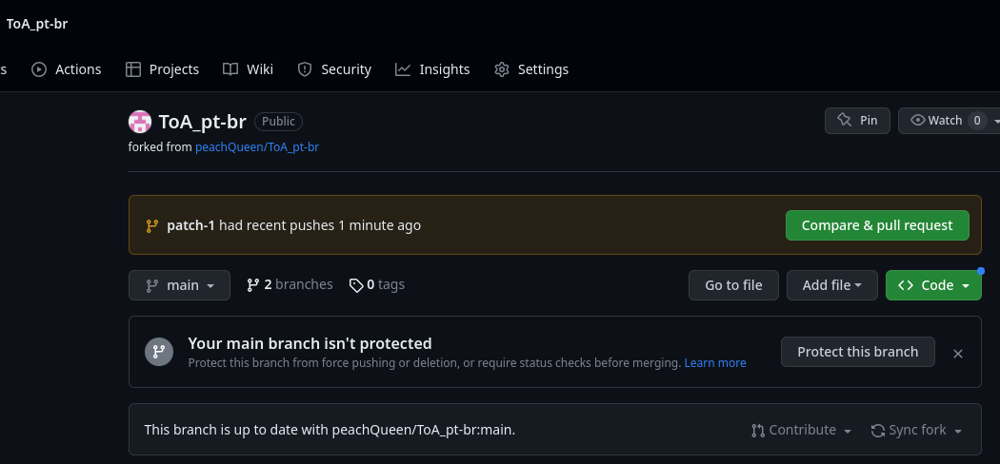
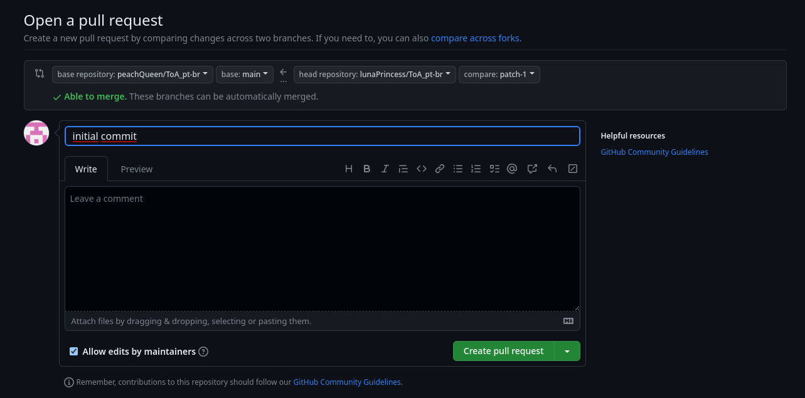

# Como contribuir

Esses passos indicam como você deve contribuir utilizando **apenas o navegador do pc**.

## 1 - Configurando o ambiente

* Crie uma conta no github [aqui](https://github.com/signup);

* Volte nesse repositório e clique no botão ``.`` (ponto) no seu teclado;

* Na barra lateral esquerda selecione qual arquivo você irá traduzir:

    

* Faça as alterações desejadas;

## 2 - Contribuindo

* No canto inferior esquerdo verifique se há algum erro no arquivo. Caso haja, haverá um indicativo nos ícones indicados.

    

  * Caso haja, corrija antes de prosseguir.

* Após isso, faça commit da suas mudanças:

    

  * Clique no botão lateral indicado;

  * Adicione um título paras alterações onde está escrito **Message**;

  * Clique no botão verde para enviar.

**OBS**: Caso seja a primeira vez que está contribuindo, irá aparecer a seguinte mensagem:

Isso pergunta se você deseja criar uma cópia do respositório para fazer as mudanças nele.

* Clique em **"Fork Respository"**

Irá aparecer a seguinte mensagem no topo da tela:

* Apenas clique ``Enter`` e prossiga.

Irá aparecer a seguinte mensagem perguntando se você quer mudar para essa cópia e fazer as alterações nela:

* Apenas clique em **"Switch to Fork``**

### 2.2 - Enviando

Após realizar a contribuição:

* Vá no seu perfil do github (caso nao encontre, pode digitar github.com/seuUsuario)

* Selecione o repositóriio que você fez uma cópia. (Ele estará com o nome de  **ToA_pt-br**)

* Entrando nele:

    

  * Clique em **"Compare & pull request"**

  * Adicone um título
    
  * Aperte em **"Create pull request"**

E pronto! Agora é só esperar.

## 3 - Mais contribuições

Caso você deseje realizar mais contribuições:

* Volte no seu perfil do github e selecione o respositório;

* Aperte ``.`` (ponto) no seu teclado;

* Faça as alterações;

* Repita o inicio do passo 2